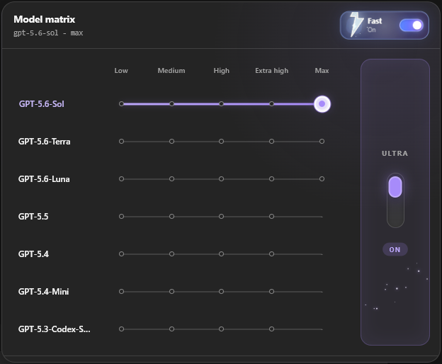
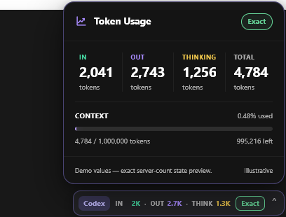
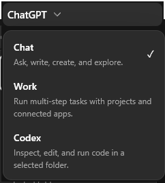

# Feature showcase

These captures contain no account name, chat title, message, local path, or
credential. The model effects and token values are non-persistent visual demos;
they did not change account settings or send a message.

## Account-backed model matrix

The replacement model picker uses the app's native account-backed model,
reasoning-effort, Ultra, and Fast callbacks while adding continuous drag motion,
moving particles, and a short lightning confirmation effect.

## Token usage dock

The right-edge dock tracks input, output, reasoning/thinking, total, and context
usage. Server values are marked Exact only when the desktop app supplies them;
Chat estimates remain explicitly labeled.

## Persistent product selector

Chat, Work, and Codex remain available after a conversation opens. Each mode
keeps its own navigation and native capabilities.
